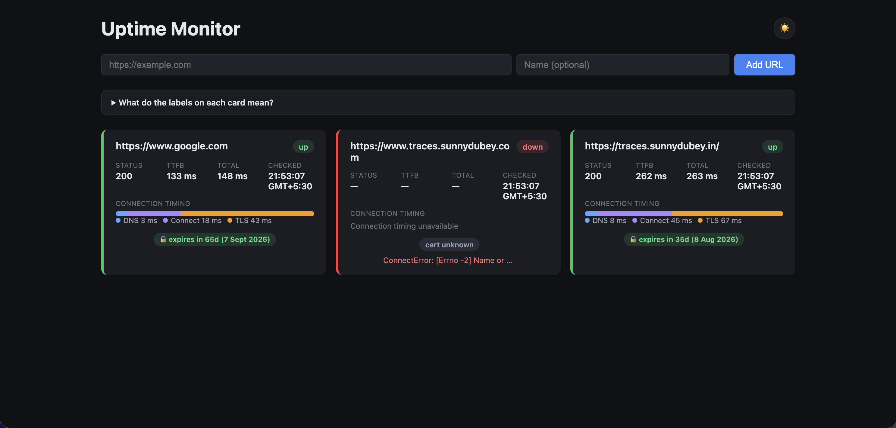

# Uptime Monitor

A minimal uptime monitor: register URLs, and an in-process scheduler pings
each one every 10 seconds and records the result. The dashboard polls the API
and shows current status (up/down), latest response time, timing breakdown,
and SSL expiry for every monitored URL.



## Stack

- **Backend**: FastAPI + httpx (async) + APScheduler (in-process, no
  Celery/Redis) + SQLModel
- **Database**: Postgres — every individual health check is stored, not just
  the latest
- **Frontend**: React + Vite, built and served by nginx
- Everything runs locally via a single `docker compose up`

---

## 1-Line Setup

```
docker compose up --build -d
```

That's it — this single command builds the images and starts Postgres, the
FastAPI backend, and the nginx-served React frontend together as one stack.

Once the containers are up:

- Frontend: http://localhost:5173
- Backend API: http://localhost:8000 (interactive docs at http://localhost:8000/docs)

Stop everything with `docker compose down` (add `-v` if you also want to
drop the Postgres volume and start from an empty database next time).

A convenience wrapper is also provided:

```
./run.sh
```

It runs the same `docker compose up --build -d`, then polls
`http://localhost:8000/health` until the backend responds and prints the
URLs above. It's optional — `docker compose up --build` directly works just
as well, and lets you watch container logs stream in the foreground.

### Troubleshooting: `docker-credential-desktop: executable file not found`

If `docker compose up` fails with an error like:

```
error getting credentials - err: exec: "docker-credential-desktop": executable file not found in $PATH
```

this is a local Docker Desktop (macOS) setup issue, not a problem with this
project — Docker is configured to look up a credential helper binary before
pulling any image (even public ones), and that binary's folder isn't on your
shell's `PATH`. Fix it by adding Docker's bundled `bin` folder to your `PATH`:

```
echo 'export PATH="/Applications/Docker.app/Contents/Resources/bin:$PATH"' >> ~/.zshrc
source ~/.zshrc
```

(use `~/.bashrc` or `~/.bash_profile` instead if you're on bash). Then retry.
If that doesn't resolve it, fully quit Docker Desktop from the menu bar (not
just closing the window) and reopen it, then try again.

---

## Testing Steps: verify up/down tracking

This walks through adding one **working** URL and one **intentionally
broken** URL, and confirming the dashboard/API report the correct state for
each.

### 1. Add a working URL

Via the dashboard: open http://localhost:5173 and use the "add monitor" form
to add `https://example.com`.

Or directly via the API:

```
curl -X POST http://localhost:8000/monitors \
  -H 'Content-Type: application/json' \
  -d '{"url": "https://example.com", "name": "Example (should be UP)"}'
```

### 2. Add an intentionally broken URL

Any URL that returns a 4xx/5xx, or that can't be reached at all, will do.
A reliably-broken one that doesn't depend on flaky external state:

```
curl -X POST http://localhost:8000/monitors \
  -H 'Content-Type: application/json' \
  -d '{"url": "https://httpstat.us/500", "name": "Broken (should be DOWN)"}'
```

If you'd rather test total unreachability (DNS failure) instead of an HTTP
error status, use a domain that doesn't resolve, e.g.
`http://this-domain-does-not-exist.invalid`.

### 3. Verify the result

A new monitor is checked immediately in the background on creation (you
don't have to wait for the 10-second scheduler tick), so within a few
seconds:

- On the dashboard, the "Example" card should show **Up**, and the "Broken"
  card should show **Down**.
- Or check via the API:

  ```
  curl http://localhost:8000/monitors
  ```

  Look for `"is_up": true` on the working monitor and `"is_up": false` on
  the broken one. The broken monitor's response will also carry an
  `error_reason` (e.g. `"HTTP 500"` or a connection/DNS exception name),
  while `status_code` and `response_time_ms` are `null` for outright
  connection failures (there was no valid HTTP response to measure).

- To confirm it keeps tracking over time rather than being a one-shot
  check, wait ~10-15 seconds and re-fetch `GET /monitors` (or just watch the
  dashboard, which polls every 5 seconds) — `last_checked_at` should have
  advanced, proving the scheduler is repeatedly re-checking both URLs.

### How "up" vs "down" is determined

- **Up**: the HTTP request completes with a 2xx or 3xx status code.
- **Down**: the request completes with a 4xx/5xx status code, or fails
  outright (timeout, DNS failure, connection refused). In the failure case,
  `status_code` and `response_time_ms` are stored as `null` since there was
  no valid response.

Redirects are not followed when checking a URL — this is what allows 3xx to
be observed and recorded as "up" per the definition above; following
redirects would silently resolve to the final status code instead.

---

## Deployment Sketch

This runs today as three containers on one Docker host, which is fine for a
demo but has two properties that matter for a real cloud deployment:

1. The scheduler is in-process inside the FastAPI app (`AsyncIOScheduler`,
   see `backend/app/scheduler.py`). Scaling the backend to more than one
   replica as-is would mean every replica polls every URL independently,
   multiplying check traffic. In production this job should be pulled out
   into its own single-instance worker (or made leader-elected /
   moved to a scheduled task) so checking stays decoupled from the number of
   API replicas.
2. State lives in Postgres only — the API containers are stateless — so the
   API itself scales horizontally without any code changes.

### Architecture

```
                                   ┌─────────────────────┐
        Users ──────────────────▶ │   CDN (CloudFront)   │  static frontend
                                   │  + S3 (React build)  │  assets
                                   └──────────┬───────────┘
                                              │ /api/*
                                              ▼
                                   ┌──────────────────────┐
                                   │  ALB (HTTPS, ACM cert)│
                                   └──────────┬───────────┘
                                              ▼
                          ┌───────────────────────────────────┐
                          │   ECS Fargate service: api         │
                          │   (FastAPI, N replicas, scheduler   │
                          │    job disabled on this service)   │
                          └──────────────────┬──────────────────┘
                                             │
                          ┌──────────────────┴──────────────────┐
                          ▼                                     ▼
              ┌───────────────────────┐            ┌─────────────────────────┐
              │  ECS Fargate service:  │            │   RDS Postgres          │
              │  checker (1 replica,   │───writes──▶│   (Multi-AZ)            │
              │  runs scheduler loop)  │            │                         │
              └───────────────────────┘            └─────────────────────────┘

              CloudWatch Logs + Alarms on all services (e.g. alert if a
              monitor's own health check fails, or task count drops to 0).
```

- **Frontend**: build the static Vite bundle in CI and push it to an S3
  bucket fronted by CloudFront, instead of serving it from nginx in a
  container — cheaper and simpler than running a container just to serve
  static files.
- **API**: ECS Fargate service behind an ALB, scaled on request count/CPU.
  Stateless, so N replicas is safe.
- **Checker**: the exact same backend image, but run as a *second* ECS
  service pinned to `desiredCount = 1`, with an environment variable
  (e.g. `ROLE=checker`) that makes `main.py` start the scheduler only in
  that role — this is the one change needed in `lifespan()` to make the
  current code deployable this way. Alternatively replace the in-process
  scheduler entirely with **EventBridge Scheduler → Lambda** (or an ECS
  Scheduled Task) invoking `check_all_monitors` every 10s/1min, which
  removes the "must stay at exactly 1 replica" constraint altogether.
- **Database**: RDS for Postgres, Multi-AZ for failover, with automated
  backups. `DATABASE_URL` is already read from an environment variable
  (`backend/app/db.py`), so no code change is needed there.
- **Secrets**: DB credentials via AWS Secrets Manager, injected into the
  ECS task definition rather than passed as plain environment variables.

### Hypothetical IaC (Terraform, abbreviated)

```hcl
resource "aws_db_instance" "uptime_db" {
  identifier          = "uptime-monitor-db"
  engine              = "postgres"
  engine_version      = "16"
  instance_class      = "db.t4g.micro"
  allocated_storage   = 20
  db_name             = "uptime"
  username            = "uptime"
  password            = var.db_password # sourced from Secrets Manager
  multi_az            = true
  publicly_accessible = false
  vpc_security_group_ids = [aws_security_group.db.id]
}

resource "aws_ecs_service" "api" {
  name            = "uptime-api"
  cluster         = aws_ecs_cluster.this.id
  task_definition = aws_ecs_task_definition.api.arn
  desired_count   = 2
  launch_type     = "FARGATE"

  network_configuration {
    subnets         = var.private_subnet_ids
    security_groups = [aws_security_group.api.id]
  }

  load_balancer {
    target_group_arn = aws_lb_target_group.api.arn
    container_name   = "api"
    container_port   = 8000
  }
}

resource "aws_ecs_service" "checker" {
  name            = "uptime-checker"
  cluster         = aws_ecs_cluster.this.id
  task_definition = aws_ecs_task_definition.api.arn # same image as api
  desired_count   = 1 # scheduler must stay single-instance
  launch_type     = "FARGATE"

  network_configuration {
    subnets         = var.private_subnet_ids
    security_groups = [aws_security_group.api.id]
  }
}

resource "aws_s3_bucket" "frontend" {
  bucket = "uptime-monitor-frontend"
}

resource "aws_cloudfront_distribution" "frontend" {
  origin {
    domain_name = aws_s3_bucket.frontend.bucket_regional_domain_name
    origin_id   = "frontend-s3"
  }
  # ... ALB origin for /api/* would be added as a second origin/behavior
}
```

This is illustrative, not a drop-in deploy — it's meant to show the shape of
the migration (stateless API service, isolated single-instance checker,
managed Postgres, static frontend on a CDN) rather than a complete,
production-ready module.

---

## Architecture notes (local/dev)

- The scheduler is a single `AsyncIOScheduler` job running inside the FastAPI
  process, firing every 10 seconds and checking all registered URLs
  concurrently with a shared `httpx.AsyncClient`. This is intentionally not
  distributed — fine for a few dozen URLs, and it also means the job runs
  once immediately on backend startup so existing monitors get fresh data
  without waiting for the first tick.
- `GET /monitors` derives each monitor's current status by looking up its
  most recent `HealthCheck` row rather than maintaining a separate mutable
  "current status" column — simplest correct option at this scale.
- The frontend polls `GET /monitors` every 5 seconds, independently of the
  10-second backend check interval — it's just how quickly the UI reflects
  data that's already there.
- `created_at`/`checked_at` are stored as timezone-aware UTC timestamps
  (`TIMESTAMPTZ`) so the API always returns an explicit UTC offset, and the
  frontend renders it in the browser's local timezone with the zone name
  shown.

## Project layout

```
backend/    FastAPI app, models, scheduler, Dockerfile
frontend/   React + Vite dashboard, nginx Dockerfile
docker-compose.yml
run.sh      convenience wrapper: build, start, wait for health, print URLs
```
